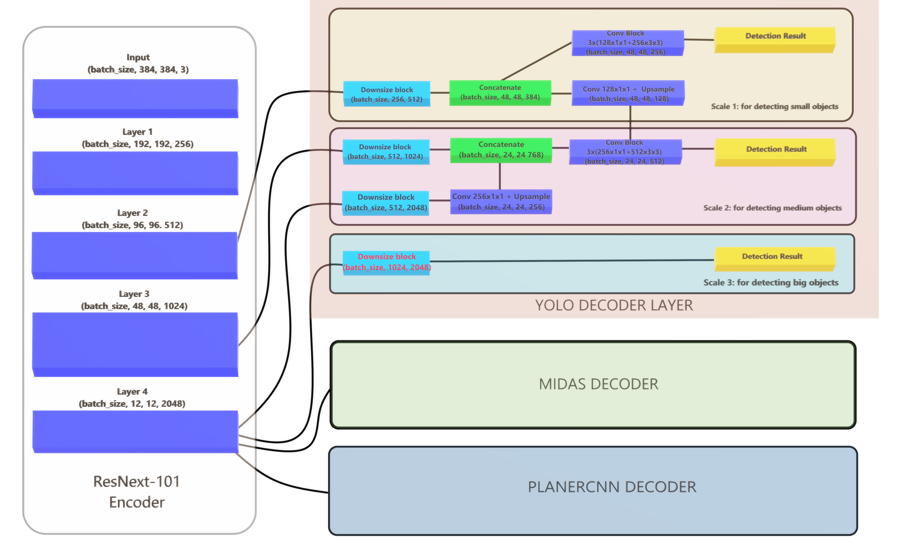
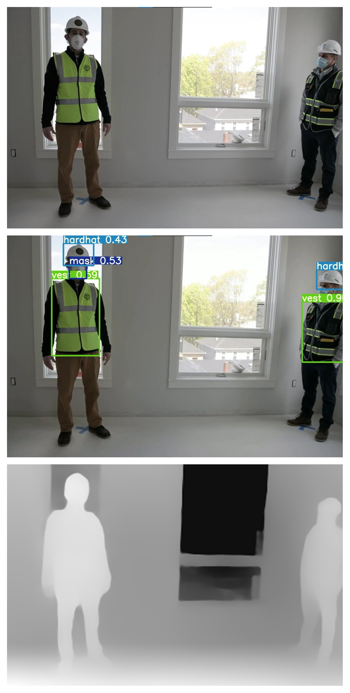

# Detecting Objects while Estimating Planes and Depths [doepd]
Please read it dope-d, I'm bad at naming things
> By Naman Shrimali

## Introduction

In this computer vision based project, we are creating a CNN based network that can simultaneously perform monocular depth estimation, as well as object detection & plane segmentation.

### Use Case
It is while developing a machine learning model to have a use case which would help solve a real world problem. This model is very good at predicting
* _Objects, such as Masks, HardHat, Boots & Vests_ : Which can be more prevalent in the times of pandemic, which can enforce protection from both physical & health hazard.
* _Monocular Depth_ : To find the distance with depth estimation, again, which can enforce physical distancing and overcrowding of places.
* _Plane Segmentation_: This essentially empowers the model to be  deployed on an autonomous bot, that can use this model for real-time tracking of changes in environment by using plane segmentation (this feature is still under works, and the developer is working hard to get this right (: ).

Introducing, *DoepdNet* (again, read it _DopeNet_)

---
## Model Architecture
I've taken Intel MiDaS as the base model, segregated it's encoder (ResNext-101) and decoder. I've then used MiDaS' encoder to replace encoder for Yolo (Darknet model) & PlanerCNN's encoder (ResNet-52). I've also added some conversion layers that acts as a link from midas' encoder to yolo decoder.

The following diagram shows the main components of DoepdNet



### Key Features
* An Encoder-(Bottleneck)-Decoder network that significantly limits number of parameters to produce different results
* Decoder network with three branches (depth, object detection, plane segmentation)

---

## Getting Started
Clone Repository
```
git clone https://github.com/namanshrimali/doepd.ai.git
```
Please use Python 3. Create an [Anaconda](https://www.anaconda.com/distribution/) environment and install the dependencies:
```
conda create --name doepd
conda activate doepd
conda install -y pytorch=1.8.1
conda install pip
pip install -r requirements.txt
```
---

## Models
Models are saved under `weights`. You can download our trained model from [here](https://drive.google.com/drive/folders/1IsKWncHbNlouM-D9ob7bGgUdRdEMQGAC?usp=sharing), and put it under `weigths` if you want to fine-tune it or run inferences.

## Training
Currently the _DoepdNet_ only support training yolo & midas.

---

## Run the Inferencing code with custom data
To inference the code, use the _inference_ script
```python
python inference.py --source "input" --output "output" --run-mode "all"
```
The various parameters used for inferencing are : 
* output : Directory where output is stored. Defaults to `output`
* source : Directory where input is stored. Defaults to `input`
* run-mode : Each run mode represents which part of model would be used for inferencing. Defaults to `all` (currently supports yolo, midas or all)
* name file : classes names for yolo to use for inferencing. Defaults to `data/custom.names` file

**To checkout my inferencing results, refer this [python notebook](DoepdInferencing.ipynb) !**

---
## What's remaining
Although I've stitched together the planercnn code with midas' encoder, I'm currently failing miserably to get the training pipeline sorted out for nvidia planercnn. I've been trying to do this since 10th april 2021, and it WON'T train (neither original planercnn, and, ofcourse, mine 😭).
### What I've tried
* Everything (I'll try to be more elborate listing here in couple of days)
### What I haven't tried
* Tensor sacrifices to ancient GPUs

---

## Results


