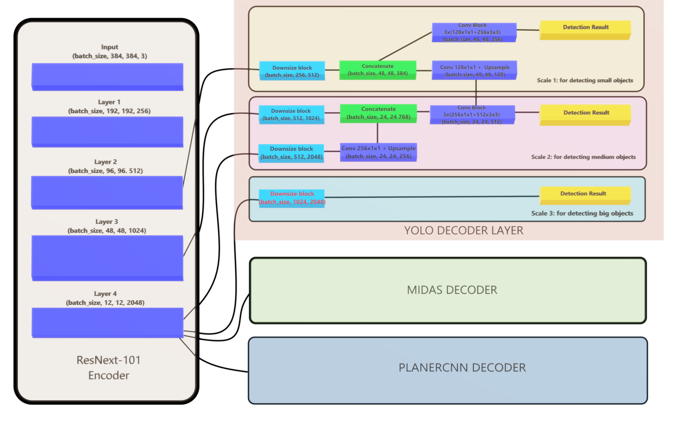

# Detecting Objects while Estimating Planes and Depths [doepd]
Please read it dope-d, I'm bad at naming things

## 1. Project Description

In this computer vision based project, we are creating a CNN based network that can simultaneously perform monocular depth estimation, as well as object detection & plane segmentation.

### Use Case
It is while developing a machine learning model to have a use case which would help solve a real world problem. This model is very good at predicting
* _Objects, such as Masks, HardHat, Boots & Vests_ : Which can be more prevalent in the times of pandemic, which can enforce protection from both physical & health hazard.
* _Monocular Depth_ : To find the distance with depth estimation, again, which can enforce physical distancing and overcrowding of places.
* _Plane Segmentation_: This essentially empowers the model to be  deployed on an autonomous bot, that can use this model for real-time tracking of changes in environment by using plane segmentation (this feature is still under works, and the developer is working hard to get this right (: ).

Introducing, *DoepdNet* (again, read it _DopeNet_)

---
## 2. Model Architecture
I've taken Intel MiDaS as the base model, segregated it's encoder (ResNext-101) and decoder. I've then used MiDaS' encoder to replace encoder for Yolo (Darknet model) & PlanerCNN's encoder (ResNet-52). I've also added some conversion layers that acts as a link from midas' encoder to yolo decoder.

The following diagram shows the main components of DoepdNet

### Key Features
* An Encoder-(Bottleneck)-Decoder network that significantly limits number of parameters to produce different results
* Decoder network with three branches (depth, object detection, plane segmentation) 

## 3. Training
Currently the _DoepdNet_ only support training yolo & midas.

## 4. Inferencing

## 5. What's remaining
I'm currently failing miserably to get the training pipeline sorted out for nvidia planercnn. I've been trying to do this since 10th april, and it WON'T train.
### What I've tried
* Everything
### What I haven't tried
* Human sacrifices to ancient GPUs

## 6. Results

